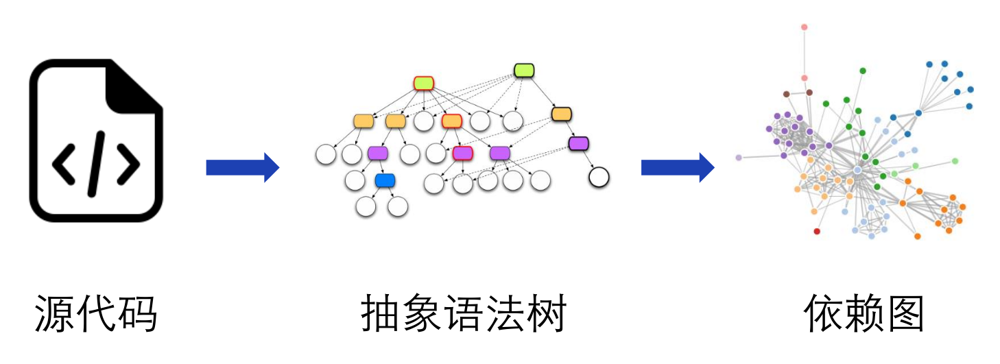
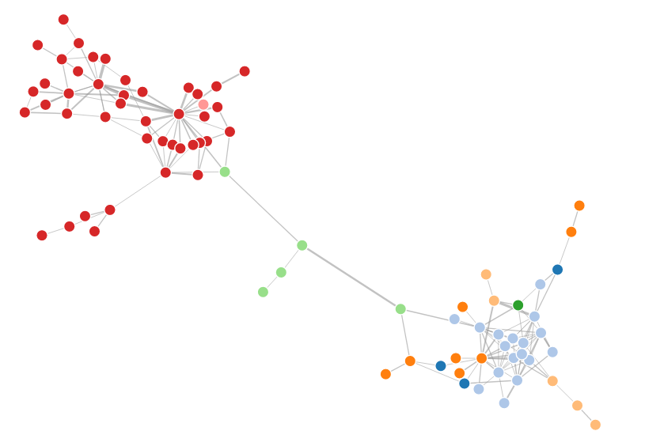

title: "Depview: Java程序调用依赖关系的分析与显示"
tags: Java
---

# DepView

[DepView](https://github.com/nettee/DepView)这个工具来自程序分析课上的一个小作业，而它的灵感来自我平时读别人代码的时候。例如我前一阵子就拿到了师兄的项目源码，一共100个Java文件，11k行代码。如何理解一个项目的代码呢？首先我们想到通过读文档、注释来理解，但师兄的项目显然是没有文档也没有注释的。或者我也可以直接向师兄请教，但师兄可能已经记不清他几个月前写代码时的思路了。于是，在很多时候，我们理解一个项目的方式只能是通过直接阅读代码，正是所谓的"Read the fucking source code"。那么，能否有一个工具来辅助我理解代码呢？

## 理解一个项目的关键点

哪些关键信息可以帮助我们很好地理解代码呢？

第一种关键信息是代码的基本使用模式，或者叫做用例。通过用例我们可以很快知道哪些模块是对外的接口，这些模块应该是我们首先关注的。如果一个项目有测试代码，而且写得比较好的话，那么通过看测试用例就可以很快知道代码的使用模式。

第二种关键信息是模块间的协作关系。很多时候程序的逻辑分散在不同的模块中，很难梳理。如果能够知道模块间的相互关系，就可以很方便地梳理程序脉络。这可以用工具来完成。我希望有一个工具能够显示模块间的依赖关系，包括：找到程序入口（模块入口），以及找出紧密协作的模块。Depview实现的是**调用依赖关系**的分析与显示。因为调用依赖关系容易定义，而且可以比较好地体现上下层模块间的关系。

## 工作步骤

Depview的工作步骤可以分为分析和显示两个部分。它首先解析源代码生成抽象语法树，在抽象语法树上提取依赖关系，最后绘制依赖图。



<!-- more -->

### 输入

Depview分析的是一个Java项目。为了分析的需要，它同时需要Java项目的源代码和编译后的字节码。由于Java项目通常依赖众多，用户还可以根据需要，将依赖也一起进行分析。为了方便输入，Depview支持用户使用一个描述文件，其中描述了该Java项目的源代码、字节码，和相关依赖。描述文件使用的格式是[HOCON](https://github.com/lightbend/config)，一种类似JSON，但更易读易写的格式。描述文件示例如下，其中大部分路径支持项目内相对路径，依赖支持Jar依赖和Maven依赖，Depview会从本地Maven仓库里拷贝出相应的Jar文件。

```yml
testSubject {
    name = DepView
    package = me.nettee.depview
    path {
        base = /home/william/projects/depview
        sources = [ src/main/java ]
        classes = [ target/classes ]
    }
    dependency.jar = [
        libs/fastjson-1.2.16.jar
        libs/guava-19.0.jar
    ]
    dependency.maven {
        repository = /home/william/.m2/repository
        jar = [
            config-1.3.1.jar
            commons-lang3-3.7.jar
        ]
    }
}
```

### 解析

Depview使用Eclipse JDT工具来将Java代码解析成抽象语法树。主要使用了`ASTParser`, `ASTNode`, `ASTVisitor`相关API，参见[Eclipse JDT相关文档](https://help.eclipse.org/neon/index.jsp?topic=/org.eclipse.jdt.doc.isv/reference/api/org/eclipse/jdt/core/dom/package-summary.html&resultof=%22ASTParser%22%20%22astpars%22)。这个工具需要同时提供source path和class path，其中class path包括项目的字节码和依赖库。

Eclipse JDT工具我在几年前就用过，但当时还不知道Maven，不理解依赖管理工具的重要性，都是从Eclipse的安装目录下拷贝jar文件到项目里作为依赖的。而且Eclipse JDT工具究竟要使用哪些Maven依赖也不太清楚。直到上次写AST相似度比较的项目，我才参考[这篇博文](http://www.shenyanchao.cn/blog/2013/06/19/use-eclipse-ast-to-parser-java/)确定了Maven依赖项。事实证明使用Maven管理确实超级方便，而且在这个项目中帮助我跳出了一个大坑。后面细说。

### 提取依赖关系

Depview通过遍历所有的抽象语法树来提取调用依赖关系。遍历可以通过继承`ASTVisitor`类，使用[访问者模式](https://en.wikipedia.org/wiki/Visitor_pattern)来遍历抽象语法树。

一个调用依赖关系包括三个元素：起始类，目标类，和调用表达式。首先，遍历是从每个**类定义**(`TypeDeclaration`)结点开始的。这个结点下面所有的调用依赖都以这个类为起始类。在遍历的过程中，寻找**方法调用**(`MethodInvocation`)结点。方法调用的形式一般为`expression.ID(args)`，提取`expression`的类型名作为目标类。

提取`expression`的类型需要使用JDT的binding功能。在测试的过程中我发现JDT对于接近一半的依赖关系无法得到binding，导致近一半的依赖关系无法提取，这会导致依赖图非常不完整。经过不断尝试，我发现新版本的JDT可以解析出绝大部分的binding。最终我使用的JDT版本（Maven依赖）为：

```XML
<dependency>
  <groupId>org.eclipse.core</groupId>
  <artifactId>org.eclipse.core.runtime</artifactId>
  <version>3.7.0</version>
</dependency>
<dependency>
  <groupId>org.eclipse.core</groupId>
  <artifactId>org.eclipse.core.resources</artifactId>
  <version>3.7.100</version>
</dependency>
<dependency>
  <groupId>org.eclipse.tycho</groupId>
  <artifactId>org.eclipse.jdt.core</artifactId>
  <version>3.12.2.v20161117-1814</version>
</dependency>
```

我不禁想，如果不是使用Maven，而是直接导入jar文件的话，我就算能想到版本不对的问题，也无法解决了。

### 依赖关系图

我将依赖关系图使用有向图建模，以类作为结点，依赖关系作为有向边。这个图允许平行边，用来表示两个类之间存在多条调用的情况；但不允许环，即忽略一个类对自身的调用。此外默认排除了标准库和第三库的依赖。有向图数据结构使用[Guava](https://github.com/google/guava/wiki/GraphsExplained)的`Network`类。

### 依赖图可视化

我选择基于D3.js的[Force-directed Graph](https://bl.ocks.org/mbostock/4062045)作为可视化方式。Neo4j数据库也是使用这种方法进行可视化的。这个图是使用“力”的概念对图进行显示的，其中边类似于弹簧，提供向内的拉力；结点类似带点粒子，互相之间存在斥力。这个图会对结点进行重新排布，有利于减少图中边的交叉。此外它是可拖拽的，交互性比较好。我将原先依赖关系图中的平行边变为边的权重，这样依赖关系越多的两个类之间的权重越大，之间的拉力也会变大。

使用这个图的时候要注意：如果两个结点之间不存在依赖关系，一定不要设置边，即使权重为零也不行！我一开始忽略了这一点，导致所有的边缠成了毛线球的样子，还以为是自己的图哪里搞错了。

最终得到的依赖图如下。可以到[这里](/depview/)尝试一下拖拽效果。


