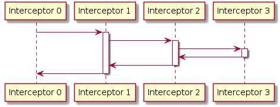

title: OkHttp 的 Interceptors 与责任链模式
date: 2018-05-01 22:53:30
tags: [Android, Java, 设计模式]
---

[OkHttp](http://square.github.io/okhttp/)是目前Android最流行的HTTP网络库。从Android 4.4开始，标准库`HttpURLConnection`的底层实现开始使用OkHttp。OkHttp + Retrofit目前是Android网络请求的主流选择。

OkHttp的源码有很多可以学习的地方，[这篇文章](https://publicobject.com/2016/07/03/the-last-httpurlconnection/)中介绍了OkHttp代码架构的进化过程。OkHttp当前的代码架构已经相当清晰。其中作为发送网络请求的核心的interceptors，是设计模式中[责任链模式(Chain-of-responsibility pattern)](https://en.wikipedia.org/wiki/Chain-of-responsibility_pattern)的一个典型的应用。

## OkHttp 的基本用法

OkHttp使用`Request`和`Response`类对网络请求的输入输出进行建模，使用`Call`对网络请求的行为进行建模。

```Java
OkHttpClient client = new OkHttpClient();

Request request = new Request.Builder()  
    .url(url)
    .header("Accept", "text/html")
    .build();

Call call = client.newCall(request);

Response response = call.execute();  
int responseCode = response.code();  
```

### Interceptors

[Interceptor](https://github.com/square/okhttp/wiki/Interceptors)是OkHttp提供的一个强大的机制。用户使用Interceptor可以对网络请求(call)进行监控、重写或重试。用户通过实现`Interceptor`接口来创建一个interceptor。例如，下面是一个对request/response记录log的interceptor：

<!-- more -->

```Java
class LoggingInterceptor implements Interceptor {
  @Override public Response intercept(Interceptor.Chain chain) throws IOException {
    Request request = chain.request();

    long t1 = System.nanoTime();
    logger.info(String.format("Sending request %s on %s%n%s",
        request.url(), chain.connection(), request.headers()));

    Response response = chain.proceed(request);

    long t2 = System.nanoTime();
    logger.info(String.format("Received response for %s in %.1fms%n%s",
        response.request().url(), (t2 - t1) / 1e6d, response.headers()));

    return response;
  }
}
```

在创建OkHttp client的时候可以指定使用自定义的interceptors：

```Java
OkHttpClient client = new OkHttpClient.Builder()
    .addInterceptor(new LoggingInterceptor())
    .build();
```

正如interceptor的名字（拦截器）所表达的含义。它可以在网络请求的过程中“拦截”request或response，进行用户自定义的操作。

## Interceptors chain

然而，在OkHttp的内部实现中，interceptors并不仅仅是拦截器这么简单。实际上，OkHttp发送网络请求的一切核心功能，包括建立连接、发送请求、读取缓存等，都是通过interceptors来实现的。这些interceptors在运行的时候彼此协作，构成了一个interceptor chain。

下面我们结合OkHttp的源码理解interceptor chain的工作方式。无论是同步请求还是异步请求，OkHttp都会进入`getResponseWithInterceptorChain()`中：

```Java
Response getResponseWithInterceptorChain() throws IOException {
    // Build a full stack of interceptors.
    List<Interceptor> interceptors = new ArrayList<>();
    interceptors.addAll(client.interceptors());
    interceptors.add(retryAndFollowUpInterceptor);
    interceptors.add(new BridgeInterceptor(client.cookieJar()));
    interceptors.add(new CacheInterceptor(client.internalCache()));
    interceptors.add(new ConnectInterceptor(client));
    if (!forWebSocket) {
        interceptors.addAll(client.networkInterceptors());
    }
    interceptors.add(new CallServerInterceptor(forWebSocket));

    Interceptor.Chain chain = new RealInterceptorChain(interceptors, null, null, null, 0,
            originalRequest, this, eventListener, client.connectTimeoutMillis(),
            client.readTimeoutMillis(), client.writeTimeoutMillis());

    return chain.proceed(originalRequest);
}
```

这里的每个`Interceptor`是进行具体工作的模块，包括用户定义的`client.interceptors()`，负责失败重试以及重定向的 `RetryAndFollowUpInterceptor`，负责把用户构造的请求转换为发送到服务器的请求、把服务器返回的响应转换为用户友好的响应的 `BridgeInterceptor`，负责读取缓存直接返回、更新缓存的 `CacheInterceptor`，负责和服务器建立连接的 `ConnectInterceptor`，用户定义的`client.networkInterceptors()`，和负责向服务器发送请求数据、从服务器读取响应数据的 `CallServerInterceptor`。

而`Chain`类则是辅助interceptors执行的工具类。`Chain`的构造函数的第5个参数表示`index`，代表第i个及以后的interceptor是有效的。`index`的初始值是0，每执行一个interceptor，它的值都会增加1。调用`Chain.proceed(Request)`时，会从第i个interceptor开始依次执行，最终返回一个response对象。每个`interceptor.intercept()`方法会调用`Chain.proceed()`来执行其后的interceptors。这样所有的interceptors可以依次被调用。时序图如下：



## 责任链模式 (Chain-of-responsibility pattern)

**责任链模式** 包含 _命令对象_ 和一系列实现了相同接口的 _处理对象_ ，这些处理对象相互连接成为一条责任链。每一个处理对象能决定它能处理哪些命令对象，对于它不能处理的命令对象，将会传递给该链中的下一个处理对象。

在 OkHttp 中，命令对象就是 `Request` 对象，处理对象就是每一个 `Interceptor` 对象。每个 interceptor 对 request 进行一些步骤的处理，而将其余的工作交给下一个 interceptor。注意到，责任链中的处理对象如果可以全权处理命令对象，则不需要交给下一个处理对象。OkHttp 中的 `CacheInterceptor` 也是具有全权处理的能力。如果请求的结果已经缓存，则不需要再交给 `ConnectInterceptor` 等进行连接服务器、发送请求的处理，直接返回已缓存的 response 即可。

## 参考文档

+ [The Last HttpURLConnection](https://publicobject.com/2016/07/03/the-last-httpurlconnection/)
+ [拆轮子系列：拆 OkHttp](https://blog.piasy.com/2016/07/11/Understand-OkHttp/)
