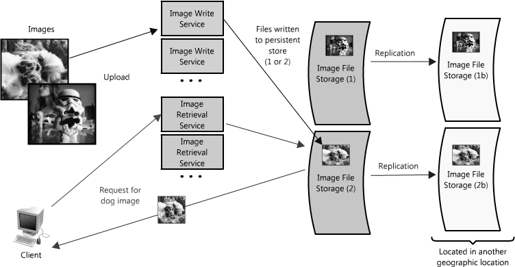
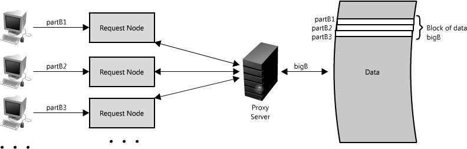
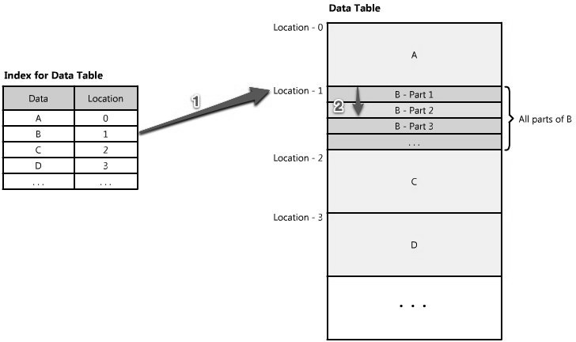

title: 可扩展的Web架构和分布式系统
date: 2016-04-20 20:31:51
tags: [Architecture, 翻译]
---

本文翻译自_The Architecture Of Open Source Applications_第二卷第一章。

原文：[Scalable Web Architecture and Distributed Systems](http://www.aosabook.org/en/distsys.html)

翻译：[nettee](http://nettee.github.io)

---

开源软件已经成为构建一些大型网站重要的基础材料。在这些网站不断发展的同时，和架构相关的最佳实践与指导原则也随之出现。这一章致力于考察设计大型网站时的一些关键问题，以及用来达成这些目标的一些基础材料。

这一章主要关注Web系统，其中一些内容同样适用于其他的分布式系统。

## 1.1 Web分布式系统设计的原则

构建和运行一个可扩展的网站或应用究竟意味着什么？最原始的网站只是让用户能通过因特网连接到远程的资源——将资源（或对资源的访问）分布在多个服务器上，便能使网站变得可扩展。

<!-- more -->

和生活中的很多事情一样，在构建一个Web服务的时候花些时间提前计划，会对长期有帮助。理解大型网站背后的一些考虑和权衡，会使你在建立小型网站时做出聪明的决定。下面是一些影响大型可扩展Web系统设计的主要原则：

+ **可用性(Availability)**：网站的响应时间对许多公司的名声和正常运作都非常的关键。对一些大型在线零售站点来说，即使是几分钟的不可访问都会导致上万元的收入损失，因此将系统设计得持续可访问，并在失效后可恢复，既是一个业务需求，也是一个技术需求。分布式系统的高可用性要求仔细考虑关键组件的冗余，部分系统失效后的恢复，以及问题发生后降低影响。

+ **性能(Performance)**：网站性能是绝大多数网站重点考虑的。网站的速度不仅影响着用户使用的满意度，还影响着搜索引擎排名，与收入和顾客保留直接相关。因此，创建一个响应迅速、延迟低的优化系统非常重要。

+ **可靠性(Reliability)**：一个系统需要是可靠的，例如请求的数据会一直返回相同的结果，而在数据改变或更新后，同样的请求应当返回新的数据。需要让用户知道，如果一些东西写入或存入了系统，会一直存留，在未来取回时仍然存在。

+ **可扩展性(Scalability)**：对于大型分布式系统而言，系统大小只是需要考虑可扩展性的一个方面。系统的可扩展性通常是指应对大量负载的能力，提高这一能力同样重要。可扩展性还可以用来指代系统的多个不同参数：可以处理多少额外的流量；存储容量是否容易添加；甚至是可以多处理多少事务。

+ **可管理性(Manageablity)**：设计容易管理的系统是另一个重要的考虑。系统的可管理性即操作（维护与升级）的可扩展性。可管理性需要考虑的事情包括诊断与理解发生的问题的容易程度，更新和修改的容易程度，以及系统运行的简单程度。（即，系统是否没有错误和异常地持续运行？）

+ **成本(Cost)**：成本是一个重要因素。显然，成本包括硬件和软件的花费，但考虑系统部署和维护的花费也很重要。系统开发时间、运行消耗甚至是培训成本都应该被考虑进来。成本应当包括所有者的全部花费。

这些原则中的每一条都提供了设计分布式Web架构时需要考虑的基础。然而，这些原则之间也可能产生冲突，实现一个目标需要以另一个目标为代价。一个基本的例子：选择简单地增加更多的服务器来提高容量（可扩展性）可能影响可管理性（需要管理额外的服务器）和成本（服务器的价格）。

设计任何Web应用的时候都要考虑这些原则，即使需要注意到，在一般情况下，一个设计可能会牺牲其中的一个或几个原则。

## 1.2 基础

对于系统架构，有不少的事情需要考虑：什么是的部分，这些部分怎么安排在一起，以及什么是正确的取舍。虽然在真正有需要之前就投资进行扩展通常不是一个明智的商业提议，但在设计上的一些远见可以在未来节省大量的时间和资源。

这一节主要讨论对几乎所有的大型Web应用都很重要的一些核心因素：服务(service)、冗余(redundancy)、分区(partition)、故障处理(handling failure)。每一个因素都涉及到取舍和妥协，特别是在前一节提到的几个原则的背景下。我们最好从一个例子开始进行详细解释。

### 例子：图片托管应用

在某一时刻你可能在网上上传了一张图片。对于托管和传送大量图片的大型站点，构建一个性价比好、可用性高、延迟低（快速检索）的架构很有挑战性。

想象一个用户可以上传图片到中心服务器上，并可以通过一个Web链接或API请求图片的系统，就像Flickr或Picasa一样。简单起见，我们假设这个应用有两个主要的部分：上传（写）图片到服务器的能力，以及请求一个图片的能力。我们当然希望上传是高效的，但我们更关注的是当请求一个图片时（如为一个网页请求图片），图片能快速地传送。这和一个Web服务器或一个CDN（Content Delivery Network，内容传送网络）边缘服务器（edge server，CDN使用的服务器，将内容存储在很多地方，所以内容在地理上/物理上接近用户，从而提高性能）提供的功能很相似。

系统的其他重要方面有：

+ 可以存储的图片数量没有限制，因此在图片数量上的可扩展性需要考虑

+ 图片的下载/请求需要低延迟

+ 如果用户上传了一张图片，这个图片要一直存在（即数据可靠性）

+ 系统应当易于维护（可管理性）

+ 由于图片托管利润率不高，系统需要较高的性价比

图1.1是系统功能的简单图示。

图1.1：简化后的图片托管架构图

在这个图片托管的示例中，系统必须要足够快，数据存储可靠，所有的属性高度可扩展。构建这个应用的小型版本很简单，只要托管在一个服务器上即可，但这样我们就没有讨论的必要了。我们假设想要构建一个可以增长到和Flickr一样大的家伙。

### 服务

当考虑可扩展性系统设计时，对功能进行解耦，并将系统的每一个部分各自考虑成具有清晰定义的接口的服务，会很有帮助。实际上，我们称这样的系统拥有面向服务的架构(Service-Oriented Architecture, SOA)。对这些类型的系统，每一个服务都有它自己清晰的功能环境，和这个环境之外的任何事物的交互都通过抽象的接口（特别是其他服务的公开API）进行。

将系统拆解为一些互补的服务的集合，可以将对这些部分的管理分离开。这种抽象帮助建立服务、服务之下的环境、服务的顾客之间清晰的关系。描述这些清晰的轮廓可以将问题隔离开，也使得每一部分可以独立地扩展。这种面向服务的系统设计和编程中的面向对象设计非常相似。

在我们的例子中，所有上传和检索图片的请求都由同一个服务器进行处理。然而，由于系统需要扩展，将这两个功能（上传和检索）分解成两个服务是有意义的。

让我们快速前进，假设服务是重度使用的。这样一个场景使我们容易看出写入的时间对读出时间的重大影响（因为这两个功能会竞争共享资源）。在一些架构上，这个影响可能是很大的。即使上传和下载的速度相同（对大多数的IP网络，这是不对的，大部分的网络都设计为至少3:1的下载/上传比），读文件基本上是从高速缓存(cache)读的，而写文件需要最终写到磁盘上（在一些情况里还可能会写多次）。即使所有的东西都在内存里，或读文件是从磁盘（如SSD）里读，数据库的写入也总是会比读取慢。(Pole Position，一个开源的数据库衡量工具，http://polepos.org/ 和结果http://polepos.sourceforge.net/results/PolePositionClientServer.pdf ）。

这个设计的另一个潜在问题是，像Apache和lighttpd这样的Web服务器可维护的同时连接数有上限（默认值在500左右，但还可以更高）。在流量很大的情况下，写操作会很快占用所有的连接。因为读操作是可以异步进行的，或是受益于其他的性能优化技术（如gzip压缩或分块传输编码），Web服务器可以快速在客户端间切换，从而支持比最大连接数多得多的服务请求（在最大连接数设置为500的Apache服务器上，每秒处理上千个读请求并不稀奇）。另一方面，写操作就需要为上传操作维护一个持续打开一段时间的连接。因此使用家庭网络（速度1MB/s——译注）上传1MB的文件用时通常会多于1秒钟，Web服务器可能只能同时处理500个进行的写操作。

图1.2： 读写分离

为这种瓶颈做计划的话，将读图片和写图片分离成两个服务是很好的做法，如图1.2所示。这不仅使我们可以独立地对它们进行扩展（因为读可能总是比写多），还让每一点发生了什么变得很清晰。另外，这样还使未来的关注点分离开，使排解故障变得更容易，也有利于对读得慢的情况进行扩展。

这个方法的好处在于我们可以单独解决每个问题，而不需要在同一个语境中讨论写入和取回图片。这两个服务仍然都影响着全局图片库，但它们可以各自用合适的方法进行优化，提升性能（例如，将请求放入队列，或将经常使用的图片缓存——下文会详细叙述）。每个服务可以独自扩展，从维护和成本的角度来看是非常好的，因为如果两者交织混杂在一起，一个服务可能在偶然间对另一个服务的性能有很大影响，正如在上面讨论过的情景中那样。

当然，在上面的例子中，如果有两个终端，效果也会很好（实际上这和很多云存储提供方的实现以及CDN非常相似）。解决这类瓶颈的方法很多，每一个都有不同的权衡。

例如，Flickr解决这个读/写问题的方法是将将用户分布到不同的shard上。每个shard只能处理一小部分的用户，在用户数量增长时，将更多的shard加入集群中（参加Flickr的扩展的presentation， http://mysqldba.blogspot.com/2008/04/mysql-uc-2007-presentation-file.html ）。在第一个例子中，基于实际使用（整个系统的读/写数）很容易扩展硬件，然而Flickr是基于用户基数扩展（但强制假设用户使用量均等，这样会有额外的容量）。在第一个例子中，断电或服务故障会使整个系统的功能失效（例如，没有人可以写文件），而Flickr的一个shard的断电却只会影响它关联的那些用户。在第一个例子中，在全部的数据集上进行操作很容易——比如更新写服务，使之包含新的元数据或在所有的元数据中搜索，而在Flickr的架构上每个shard都需要更新或搜索（或者，需要创建一个搜索服务，整理元数据——他们实际上就是这么干的）。

对于这些系统架构，没有一个最终正确的答案。但我们应当回到本章开头的那些原则，判断系统的需要（重度读还是重度写，并发层级，数据集上的请求，范围，排序，等等），衡量不同的替代品，理解系统是如何失效的，并对失效发生有一个清晰的应对计划。这些都对建立一个好的系统架构很有帮助。

### 冗余

为了优雅地处理失效问题，一个Web架构必须有服务和数据的冗余。例如，如果文件只有一个拷贝，存储在单个服务器上，那么服务器的损坏就意味着文件的丢失。丢失数据从来不是一件好事，通常的应对方法是创建多个冗余的拷贝。

同样的原则也适用于服务。如果有一个应用的核心功能，保证有多个拷贝或多个版本在同时运行，可以免于单个服务结点失效的危害。

在系统中创建冗余可以消除单点失效问题，并在发生危机时提供备份或多余的功能。例如，如果在产品中有相同服务的两个实例在运行，其中一个失效或退化，系统可以*故障转移*(failover)到另一个健康的拷贝上。故障转移可以是自动进行，或是需要人工干预。

服务冗余的另一个关键部分是创建一个*无共享架构*(shared-nothing architecture)。在这个架构中，每个结点都可以独立于其他结点运行，没有中央的管理状态的“大脑”，也也没有和其他结点协调进行的活动。在对可扩展性很有好处，因为新结点的添加不需要特殊条件和知识。然而最重要的是，这些系统中的没有单点故障，所以他们在失效后更容易恢复。

例如，在我们的图片服务应用中，所有的图片都在别处的一个硬件上有一份冗余拷贝（最理想的是在不同的地理位置上，以防地震、火灾等的发生）。访问图片的服务也是冗余的，都有请求处理的可能。（见图1.3）（负载均衡器是实现这一点的好办法，下文会详细叙述）。

图1.3： 带有冗余的图片托管应用

### 分区

数据集可能会有很大，导致单个服务器装不下；也可能是一个操作需要太多的计算资源，降低了性能，导致必须增加容量。在这样的情况下你有两种选择：垂直分区或是水平分区。

垂直扩展意味着在一个服务器上增加更多的资源。因此对于很大的数据集，这可能意味着增加更多（或更大的）硬盘驱动器，使一个服务器可以包含整个数据集。对于计算操作，这可能意味着将计算移动到有更快的CPU、更大的内存的服务器上。对于每种情况，垂直扩展总是通过使个体的资源的能力更强来实现。

另一方面，水平扩展则是增加更多的结点。对于很大的数据集，这可能是有第二个服务器来存储部分数据。对于计算操作，这可能意味着将操作或负载分离到某个额外的结点上。为了充分利用水平扩展，它需要作为系统架构的固有设计原则引入，否则为它修改和分离出环境会相当麻烦。

当谈到水平扩展时，最常见的技术之一就是将你的服务分解为多个分区(partition)，或是多个shard。分区是可以分开的，于是每个逻辑功能集都分开了。可以按地理的边界划分分区，或是用其他标准，如免费用户和付费用户。这种计划的好处是为服务或数据提供了增加的容量。

在我们的图片服务器的例子中，将用来存储图片的单个文件服务器替换为多个文件服务器是可行的，每个服务器包含它自己独一无二的图片集。（见图1.4）。这样的架构让系统可以在每个文件服务器上填充图片，在磁盘满的时候增加额外的服务器。这种设计需要一个命名规则，将图片的文件名关联到它所在的服务器。一个图片的名字可以由一个在所有服务器相同的散列规则来生成。或者用另一种方法，每个图片都分配一个自动增加的ID，当客户端请求图片时，图片取回服务只需要维护每个服务器映射到的ID的范围（类似于一个索引）即可。

图1.4：带有冗余和分区的图片托管应用

将数据或功能分布在多个服务器上当然是有挑战的。一个主要的问题就是*数据局部性*(data locality)。在分布式系统中，数据距离操作或计算点越近，系统的性能就越好。因此将数据散播在多个服务器上可能会有问题，因为当需要的数据不在本地的时候，就迫使服务器进行在网络上请求信息的昂贵操作。

另一个潜在的问题是*不一致*(inconsistency)。当有多个服务从一个共享的资源（可能是另一个服务或数据存储）读写时，有可能产生竞争条件(race condition)——当数据应当更新时，读操作却在更新之前进行——在这些情况下数据会不一致。例如，在图片托管的场景中，竞争条件可能在这种情况下出现：一个客户端发送请求，将狗的图片的标题从"Dog"更新为"Gizmo"，但同时另一个客户端正在读图片。我们不清楚第二个客户端应该收到标题"Dog"还是"Gizmo"。

将数据进行分区一定会伴随着一些障碍，但分区使每个问题可以根据数据、负载、使用模式等分离为可管理的块。这对可扩展性和可管理性有帮助，但也不是没有危险。有很多方法可以减轻风险和处理失效，然而，为了简洁，本章中没有涉及这些内容。如果你想了解更多，可以查看我的[博文][blogspot]中关于容错的内容。

[blogspot]: http://katemats.com/distributed-systems-basics-handling-failure-fault-tolerance-and-monitoring/

## 1.3 快速可扩展数据访问构件

讲完设计分布式系统的一些核心考虑后，我们来谈谈一个比较难的部分：扩展数据访问。

大多数简单的Web应用，例如LAMP stack应用，看起来像是图1.5中这样。

图1.5：简单的Web应用

当这个应用进行扩展时，主要有两个挑战：扩展对应用服务器的访问，和对数据库的访问。在高度可扩展的应用设计中，一个应用服务器（或Web服务器）通常是最小化的，包含一个无共享架构。这使系统中的应用服务器层水平可扩展。这种设计导致负担传递到栈下层的数据库服务器和配套服务上，在这一层才是扩展和性能的挑战真正起作用的地方。

本章的余下部分将着重讲述一些常见的策略和方法，通过提供快速数据访问，使这些服务快速而可扩展。

图1.6：过于简单化的Web应用

大多数系统可以简化到图1.6。从这里讲起很合适。如果你有很多的数据，想要快速而容易地访问，类似在你书桌最上面的抽屉里储存一堆糖果。虽然过分简化了，上面的句子还是暗示出了两个难题：存储可扩展和数据可快速访问。

在本节中，假设你有很多TB的数据，你想让用户可以随机访问一部分数据。（见图1.7）。这和上面图片应用的例子中，在文件服务器上定位一个图片很相似。

图1.7：访问特定的数据

这件事很有挑战性，因为将TB级的数据装进内存的开销非常大，会直接带来很多的磁盘IO。从磁盘读比从内存读慢很多——内存访问和查克-诺里斯一样快（Chuck Norris，美国动作片演员——译注），然而磁盘访问却比美国车辆管理局的队伍还慢。这个速度上的差异对于大数据集会更明显。对于浮点数，内存在顺序读的情况下比磁盘快6倍，在随机读的情况下比磁盘快100000倍（见“大数据病理学”，http://queue.acm.org/detail.cfm?id=1563874 ）。此外，即使对于独一无二的ID，找到那很少量的数据都是一项很费力的任务，就像不看一眼就找到你的糖果中的暴风果橡皮糖一样。

幸运的是你有很多选择使这项工作变得容易。四个常见的策略是缓存、代理、索引和负载均衡器。本节余下的部分会讨论这些概念如何使数据访问变得更快。

### 缓存

缓存利用的是引用的局部性原理：最近请求过的数据很可能会被再次请求。缓存被用在计算机的几乎所有层次：硬件，操作系统，浏览器，Web应用，等等。缓存像一个短期的内存：它的空间有限，但通常速度比数据源快，含有最近最常访问的数据。缓存可以在架构中的任何一个层次存在，但经常是出现在最靠近前端的层次，实现为快速返回数据，不增加下层的负担。

在我们的API例子中，缓存是如何能够使数据被快速访问的呢？在这个例子中，你可以在好几个地方插入缓存。一个选择是将缓存插入请求层结点，如图1.8所示。

图1.8：在请求层结点插入缓存

将缓存直接放入请求层结点使该结点可以在局部存储响应数据。每次一个请求发往这个服务，结点如果有缓存着的数据，都会快速返回。如果数据不在缓存中，请求结点会从磁盘请求数据。一个请求层结点的缓存既可以是放在内存中（速度非常快），也可以放在结点的磁盘中（比通过网络获得要快）。

图1.9：多个缓存

如果将缓存扩展到多个结点上会怎么样呢？如图1.9所示，如果请求层扩展到多个结点，每个结点仍很有可能拥有自己的缓存。然而，如果你的负载均衡器随即地在结点间分发请求，同一个请求可能发往不同的结点，这会增加缓存不命中的次数。克服这个障碍的两种选择是：全局缓存和分布式缓存。

### 全局缓存

一个全局缓存的表现和它的名字一样：所有的结点使用相同的单一缓存空间。这需要增加一个服务器或某种文件存储，比原先的存储要快，而且可以被所有的请求层结点访问。每个请求层结点使用和查询局部缓存一样的方法查询全局缓存。这种缓存策略会有点复杂，因为它在客户端和请求的数量增加时，很容易就压垮了单个的缓存。但在一些架构中，这种方法很有效，尤其是一些有特殊硬件的架构，硬件可以实现很快速的全局缓存，或架构中需要缓存的数据集大小确定。

全局缓存有两种描述形式。在图1.10中，当在缓存中没有发现已缓存请求时，缓存自己负责从底层存储获取缺失的数据。在图1.11中，是由请求层结点负责获取缓存中没有的数据。

图1.10：缓存负责获取数据的全局缓存

图1.11：请求结点负责获取数据的全局缓存

使用全局缓存的应用大部分倾向于使用第一种，因为缓存自己管理了数据的回收和获取，防止了从客户端大量请求相同的数据。然而，在一些情况下第二个实现更有意义。例如，如果缓存正在一个很大的文件上工作，很低的缓存命中率会使缓存区不堪重负。在这种情况下就需要将全部数据集（或热点数据集）的大部分放在缓存中。另一个例子是缓存中存储的文件都是静态的，不应被回收。（这可能是因为应用对于数据延迟的要求——特定的数据需要在大数据集中能很快访问到——应用逻辑比缓存更理解回收策略和热点。）

### 分布式缓存

在分布式缓存中（图1.12），每个结点都拥有一部分缓存数据。那么，如果把缓存比作杂货店里的冰箱的话，分布式缓存就是将食物放在好几个地方——冰箱、橱柜*和*饭盒——不需要去商店就能拿到零食。通常，缓存是用一个全局唯一的散列函数分割的，一个请求结点寻找特定数据时，可以快速知道去哪个缓存上寻找，判断数据是否可获取。在这种情况下，每个结点都有少量的缓存，在将数据送回原处之前会想其他结点发送数据的请求。因此，分布式缓存的一个好处就是增加了缓存空间，且只需要为请求池增加结点就可以实现。

分布式缓存的一个缺点是补救缺失结点。一些分布式缓存通过在不同的结点上存储数据的多个拷贝来对付这种情况。然而，你可以想象很快逻辑会变得多么复杂，特别是当你从请求层增加或删除了结点时。即使一个结点消失了，部分的缓存丢失，请求还会将它们从原处拉过来——这是一个不必要的灾难！

图1.12：分布式缓存

缓存的一个很大的好处是它们通常会使一切更快（当然，是在实现正确的情况下）。你选择的方法允许你即使在更多请求的情况下也能使它更快。然而，所有这些缓存都以要有维护额外存储空间的代价，通常是昂贵的内存；没有什么是免费的。缓存在加速上面做得很好，此外还使系统在高负载的情况下运行良好。没有缓存，服务可能会整个退化。

一个流行的开源缓存的例子是Memcached(http://memcached.org/ )（既可以作为局部缓存也可以作为分布式缓存）。其他的选择还有很多，包括很多特定语言、特定框架下的选择。

Memcached被很多大型的网站使用。虽然它可以非常强大，但它只是一个简单的内存中的键-值存储，为任意的数据存储和快速查找（*O(1)*）优化过。

Facebook使用多不同类型的缓存维持网站的性能（见“[Facebook缓存与性能][facebook-caching]”）。他们使用`$GLOBALS`和语言级的APC缓存（在PHP中以一个函数调用为代价提供），使中间层函数调用和返回更加快速。（大多数语言都有这种类型的库，用于提升网页性能，应该一直使用它们。）Facebook还使用了一个分布在很多服务器上的全局缓存（见“[扩展Facebook的memcached][facebook-memcached]”），这样一个访问缓存的函数调用就可以得到多个请求，并行请求不同的Memcached服务器上存储的数据。这使他们对用户配置数据有更高的性能和吞吐量，并且有一个更新数据的中心位置（这很重要，因为缓存失效和维护一致性在运行上千个服务器时是很有挑战性的）。

[facebook-caching]: http://sizzo.org/talks/
[facebook-memcached]: http://www.facebook.com/note.php?note_id=39391378919

现在让我们谈谈当数据不在缓存中时该怎么办……

### 代理

在基础层面上，代理服务器是一个硬件/软件的中间片，从客户端接收请求，并转播到后端服务器。代理通常用来过滤请求和记录请求，有时候也用来变换请求（通过增加/删除头部，加密/解密，或是压缩）。

图1.13：代理服务器

代理在将来自多个服务器的请求整合在一起的时候也非常有用，提供了从整个系统角度优化请求量的机会。使用代理加速数据访问的一种方法是将相同或相似的请求压缩为一个，然后为发送请求的客户端返回同一个结果。这就是压缩转发(collapsed forwarding)。

想象一下在多个结点上有对同一个数据（叫它littleB）的请求，且这个数据不在缓存中。如果请求是通过代理发送，那么所有的请求就会被压缩成一个，这意味着我们只需要从磁盘上读一次littleB。（见图1.14）。这个设计会带来一些开销，因为每个请求的延迟会稍高，并且一些请求可能会因为要和相似的请求合并而有轻微的延期。但这种做法在高负载，尤其是一些数据被一次又一次地请求的情况下，会大幅提升性能。这和缓存很像，但与缓存将数据/文档存储起来不同，代理是优化对文档的请求或调用，充当这些客户的代理人。

例如，在LAN代理中，客户无需知道自己的IP地址，就可以连接Internet，并且LAN会将用户对相同内容的请求压缩为一个。这里很容易搞混，因为很多代理同时就是缓存（因为代理是很适合放置缓存的地方），但不是所有的缓存都像代理一样工作。

图1.14：使用代理服务器压缩请求

另一个使用请求的很好方式是不仅仅压缩对同一个数据的请求，还压缩对原存储中相距很近（在磁盘上连续）的数据的请求。使用这个策略最大化了请求的数据局部性，可以降低请求延迟。例如，我们有一堆结点请求B的一部分：B1，B2，等。我们可以将设定代理识别空间局部性，将它们压缩为同一个请求，只返回bigB，这样就极大地减小了从数据源读的次数。（见图1.15）。这可以在你从TB级的数据中随机访问时减少很多请求时间！代理还在高负载或是缓存空间有限时非常有用，因为它们能一次处理一批数据。

需要注意的是，你可以同时使用代理和缓存，但通常最好将缓存放在代理前面，这和马拉松比赛中让跑的最快的人最先跑是一个道理。因为缓存是从内存中提供数据，它很快，而且不在意对同一个结果的多个请求。但如果缓存被放在代理的后面，每个在缓存前面的请求就会有额外的冗余，这也会拖累性能。

如果你计划在系统中增加代理，有很多中方法可以考虑。[Squid][squid]和[Varnish][varnish]都已经经过实际试验，在很多网站中使用。这些代理的实现提供了很多优化，充分利用客户-服务器的通信。在Web服务器层安装一个作为反向代理（在下面负载均衡器一节会解释）会可观地提升Web服务器的性能，减少处理进入的客户所需的工作量。

[squid]: http://www.squid-cache.org/
[varnish]: https://www.varnish-cache.org/

### 索引

使用索引来快速访问数据是一个广为人知的优化数据访问性能的方法，在数据库方面可能是最知名的。索引通过增加存储开销和写操作时间（因为你必须同时写数据和更新索引）来换取更快的读。

正如传统的关系型数据存储一样，你也可以将这个概念应用到更大的数据集上。索引的技巧是你需要仔细考虑用户会如何访问你的数据。在数据集是TB大小，但负载非常小（如1KB）的情况下，索引是数据访问优化中必须的。在如此大的数据集上寻找一个小负载会是一项很大的挑战，因为你不可能在合理的时间内遍历这么多数据。幸运的是，如此大的数据集很可能是分布在多个物理设备上——这意味着你需要用某种方法找到你想要的数据的物理位置。使用索引是最好的方法。

图1.16：索引

索引用起来像是指引你数据所在位置的目录。例如，我们假设你在寻找一份数据，B的第2部分——你如何知道去哪里找它？如果你有按照数据类型（像是A,B,C）排序的索引，它就可以告诉你数据B的位置。然后你就只需要寻找那个位置，读取数据B你想要的部分。（见图1.16）。

这些索引通常是存储在内存中，或是在距离客户请求很近的地方。人们通常使用Berkeley DBs(BDBs)和树形的数据结构来将数据以顺序表的形式存储，这种结构非常适合索引的访问。

索引通常有多层，像一个地图一样将你从一个地方送到另一个地方，直到你获得你想要的特定数据为止。（见图1.17）。

图1.17：多层索引

索引还可以用来创建关于同一个数据的不同视图(view)。对于大数据集，这种是定义不同的过滤和排序的很好方法，不需要重新排序而创建数据的很多个拷贝。

例如，想象早前图片托管系统实际上是托管着图书页面的图片，且服务允许用户请求这些图片上的文字，搜索关于一个话题的所有图书内容（和搜索引擎允许你搜索HTML内容的方式一样）。在这种情况下，所有这些图书图片使用很多很多的服务器来存储文件，寻找一个页面来为用户渲染可能有些复杂。首先，请求任意词和词组的倒排索引(inverse index)需要易于访问；其次，精确定位到书中的页面和位置，并将正确的图片取回，也是一个挑战。因此在这种情况下倒排索引会映射到一个位置上（如图书B），然后B可能包含一个关于每一部分的所有词、位置、出现次数的索引。

一个倒排索引（在上面的图中可能表示索引1），可能是下面这个样子的——每个词或词组都提供了包含它们的图书的索引。

| 词/词组 | 图书 | 
| :-- | :-- |
| being awesome | Book B, Book C, Book D |
| always | Book C, Book F |
| believe | Book B |

中间层索引样子差不多，但只包含词、位置和B书的信息。这个嵌套的索引架构相比一个巨大的倒排索引，每个索引都占用较少的空间。这在大型系统中很重要，因为这些索引即使压缩过也可能很大，带来很大的存储开销。在这个系统中如果假设我们有很多图书——1亿本（见[Inside Google Books][inside-google-books]博文）——为方便计算，每个图书只有10页大小，每页250个词，这意味着有2500亿个词。如果我们假设平均每个词5个字母，每个字符占8位（即1字节），那么一个仅包含每个词一次的索引就有超过TB的大小。你可以看出，创建包含很多信息（像词组、数据位置、出现次数）的索引，大小会迅速增长。

[inside-google-books]: http://booksearch.blogspot.com/2010/08/books-of-world-stand-up-and-be-counted.html

创建这些中间索引，表示数据的一小部分，使大数据的问题易于处理。数据可以分布在很多个服务器上，仍然访问迅速。索引你一个信息检索的里程碑，是现代搜索引擎的基础。当然，这一节只是讲了一点皮毛，有很多的研究是关于如果使索引更小、更快、包含更多的信息（如relevancy），以及无缝更新。（有一些管理上的挑战，关于竞争挑战的，和关于增添或改变数据时需要的更新次数的，尤其是在涉及到relevancy或scoring的时候）。

快速而容易地找到数据是一个重要的能力，索引是实现这个能力的一个有效和简单的工具。

### 负载均衡器

最后，另一个在任何分布式系统上都很重要的部分的是负载均衡器。负载均衡器每个架构上的首要部分，因为它们的角色是将负载分布到负责请求服务的结点上。这使系统中多个结点可以透明地服务同一个功能。（见图1.18）。它们的主要目标是处理很多相同的连接，并将这些连接发送到其中一个请求结点(request node)，使系统得以扩展，通过增加结点服务更多的请求。

服务请求有很多算法可以使用，包括随机挑选结点，轮流选择，甚至是基于内存或CPU利用率挑选结点。负载均衡器可以实现为软件或硬件应用。一个获得广泛使用的开源软件负载均衡器是[HAProxy][haproxy]）。

[haproxy]: http://haproxy.1wt.eu/

在一个分布式系统中，负载均衡器通常是在系统的最前端，于是所有进来的请求都经它发送。在一个复杂的分布式系统中，一个请求经过多个负载均衡器并不少见。（见图1.19）。

图1.19：多个负载均衡器

和代理一样，一些负载均衡器也可以根据请求的类型不同发往不同的结点。（技术上这些也叫反向代理。）

负载均衡器的一个挑战是处理特定于用户会话的数据。在一个电商网站上，如果你一个一个客户，你很容易让客户将物品放入购物车，并在两次访问之间保留这些内容（这很重要，因为如果在用户回来的时候商品已经不在购物车里，你可能就卖不出去商品了）。然而，如果用户请求在第一次会话时发送到一个结点，第二次的时候发送到另一个结点，因为新的结点可能缺少那个用户购物车的内容，就可能出现不一致。（如果你放了6包激浪在购物车里，回来的时候发现购物车是空的，你会不会很烦乱？）一个解决方法是使会话有黏性，同一个用户的请求总是发送到相同的结点上，但这样就很难利用一些可靠性功能如自动故障转移。在这种情况下，用户的购物车可以一直保留其中的内容，但如果它们黏住的结点不可用，就需要一个特殊情况，并且关于内容的假设不再有效（虽然这假设不是固定在应用中的）。当然，这个问题可以通过使用其他策略和工具解决，例如服务，以及其他未涉及到的内容（如浏览器缓存，cookie，URL重写）。

如果系统只有少数几个结点，循环式DNS之类的会更有用，因为负载均衡器可以会很昂贵，而且增加了一层不必要的复杂性。当然在大型系统中有各种不同的调度和负载均衡算法，包括简单的随机抽取和循环式，和更复杂的如考虑利用率和容量。所有这些算法都允许分布流量和请求，而且可以体用有用的可靠性工具如自动故障转移，或自动移除坏点（像不可响应的结点）。然而，这些高级特性会使错误诊断变得很麻烦。例如，对高负载的情况，负载均衡器会移除缓慢或超时的结点（因为请求太多），但这只会加重其他结点的负担。在这种情况下广泛的监督很重要，因为总体的系统流量和吞吐量可以看起来是下降的（因为结点服务更少的请求），但单个结点已经超载。

负载均衡器是一个扩展系统容量的简单方法，和这篇文章中的其他技术一样，在分布式系统架构中是一个不可缺少的角色。负载均衡器还提供了了测试结点健康度的关键功能，如果一个结点不响应或过载了，它可以从处理请求的池中移除，利用系统中不同结点的冗余。

### 队列

目前我们已经谈论了很多快速读数据的方法，但扩展数据层的另一个重要的部分是对写的高效管理。当系统很简单时，只有很少的处理负载，很小的数据库，写操作当然会很快。然而，在更复杂的系统中，写操作可能会占用几乎无法确定的大量时间。例如，数据可能需要写到不同服务器和索引上的几个地方，或系统就简单的在高负载下。在写操作（或其他类似的任务）可能占用很长时间的情况下，追求性能和可用性需要在系统中建立异步机制，常见的办法就是使用队列。

图1.20：同步请求

想象一个系统，其中每个客户都请求一个可被远程服务的任务。每个客户将它们的请求发到服务器，服务器尽快完成任务，并将结果返回给各自的客户。在小型系统中，一个服务器（或逻辑服务）可以很快处理到来的客户，这种情形工作得还不错。然而，当服务器接收到多于它所能处理的请求时，每个客户就必须等待其他客户的请求处理完，才能生成响应。这是一个通过请求的例子，如图1.20所示。

这种同步行为可能严重降低客户性能。客户必须等待，在请求得到应答前都做不了任何工作。增加额外的服务器处理系统负载也无法解决这个问题，甚至使用高效的负载均衡器也很难保证平等分配工作，最大化客户性能。此外，如果处理请求的服务器是不可用的，或失效的，上游的客户也会失效。要有效解决这个问题，需要在客户请求和实际的服务之间进行抽象。

图1.21：使用队列管理请求

开始讲队列。一个队列和它表面一样简单：一个任务来到后，被添加到队列中，结点在它们有容量处理任务的时候从队列中取出下一个。（见图1.21。）这些任务可以表示简单的写数据库，或是复杂到生成文档预览缩略图。当客户提交了任务请求后，不再需要等待结果，而只需要确认请求被收到。这个确认在后面可以在客户需要的时候引用到结果。

队列使客户可以用异步的方式工作，提供了一个对客户请求和响应策略上的抽象。另一方面，在同步系统中，请求和回复没有区别，因此也不能分别管理。在异步系统中，客户请求一个任务，服务端响应一个消息，确认任务收到，然后客户就可以周期性检查任务状态，只在任务完成之后请求结果。在客户等待异步请求完成时，它可以随意进行其他工作，甚至是发送其他服务的异步请求。后者是队列和消息在分布式系统中应用的例子。

队列还提供了一些保护，免于服务中断和失效。例如，很容易创建一个高度健壮的队列，重试因为短暂的服务失效带来的失败的服务请求。更好的方法是使用队列强制实行服务质量保障，而不是将客户直接暴露在间歇的服务中断中，导致复杂的，常常是不一致的客户端错误处理。

队列是管理大型分布式系统中不同部分的分布式通信的根基。实现队列有很多种方法，有很多开源的队列如[RabbitMQ][rabbitmq], [ActiveMQ][activemq], [BeanstalkD][beanstalkd]，但一些也使用了像[Zookeeper][zookeeper]的服务，甚至是像[Redis][redis]的数据存储。

[rabbitmq]: http://www.rabbitmq.com/
[activemq]: http://activemq.apache.org/
[beanstalkd]: http://kr.github.com/beanstalkd/
[zookeeper]: http://zookeeper.apache.org/
[redis]: http://redis.io/

## 1.4 结论

设计高效的、可以快速访问大量数据的系统，是一件激动人心的事，有很多很好的工具带来了各种新的应用。这一章涉及了几个例子，简单地进行了介绍，但后面还有很多很多，会有不断的创新出现。
