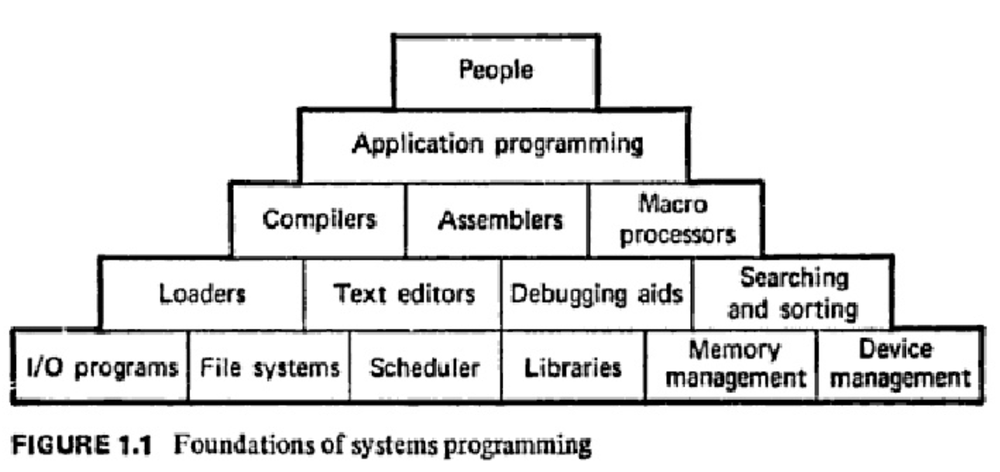
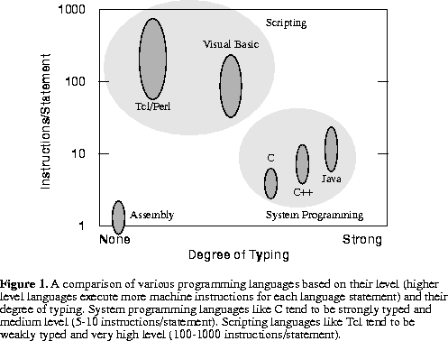

title: 到底什么是系统编程？
date: 2018-11-28 13:54:05
tags: [翻译, C++, Go, Rust, System]
---

此文翻译自 Will Crichton 的博客中 2018 年 9 月 9 日的一篇文章。

原文：[What is Systems Programming, Really?](http://willcrichton.net/notes/systems-programming/)

翻译者：[nettee](http://nettee.github.io/)

译者前言：Go 语言诞生也将近十年了，但它的发展并没有很多人当时期望的那样如火如荼。按照 Go 是 “系统语言”的说法以及 Go 的语法设计，它似乎是以取代 C/C++ 为目标的。然而现如今 Go 没有撼动 C/C++ 一丝一毫的地位，倒是取代了一些 Python 在服务器端的工作。但 Go 语言的作者仍然坚称 Go 是“系统语言”。我们该如何看待“系统语言”这个术语？我们又该如何理解 Go 语言和最近流行的 Rust 语言的定位？我们究竟要不要学习它们？学习它们的什么地方？这篇文章梳理了程序语言的发展历史，能够给我们一个思路。

---

前言：我对“系统编程” (systems programming) 这个词不太满意。对我而言，它实际上把两个概念混为一谈：“底层编程”（关注机器的实现细节），以及“系统设计”（创建并管理一系列复杂的交互的组件）。为什么会这样？这种情况持续了多久？重新定义“系统”这个概念，我们会得到什么启发？

# 1970 年代：汇编之上的改进

让我们回到现代计算机系统诞生的时候，看看这个术语是如何改变的。我不知道是谁最先创造了这个词语，但我发现对于“计算机系统”的定义始于 70 年代初期。在 [系统编程语言](https://www.sciencedirect.com/science/article/pii/S0065245808605100) (Bergeron et al. 1972) 中，作者写道：

> 系统软件是一些子软件的集合。这些子软件形成一个整体，超过部分之和，并使整体有相当大的规模和复杂性。典型的例子包括 multiprogramming、翻译、模拟、信息管理、time sharing 的系统。[…] 下面是系统软件的几个特性。系统软件不必包含所有的特性，而且一些特性也会出现在非系统软件中。
> 1. 需要解决的问题内涵广泛，由许多（而且常常是多种多样）的子问题组成。 
> 1. 系统程序可能是用于支持其他的软件和应用程序，也可能本身就是一个完整的应用程序。
> 1. 它是为持续的“产业”使用而设计，而不是针对单个应用程序问题的一次性解决方案。
> 1. 它可以持续地演化，支持不同数量和种类的特性。
> 1. 系统程序无论是模块内还是模块间（即“通信”），都需要遵循一定的规则或结构。它常常是由多人设计并实现的。

这个定义还是比较合理的：计算机系统是大规模的、长期使用的、随时间变化的。然而，虽然定义中大部分是描述性的，有一个关键点却是限定性的：提倡区分底层语言和系统语言（在当时，也就是指区分汇编和 FORTRAN）。

> 系统编程语言的目标是可以在不过分关注底层细节的情况下使用，但编译得到的底层代码不会比直接手写的差。这种语言需要结合高级语言的简洁性和可读性，以及汇编语言的时间空间效率、深入机器和操作系统的能力。它应该能在不带来额外系统资源开销的前提下，尽量减少设计、编写、调试的时间。

与此同时，CMU 的研究人员发表了 [BLISS: 一个系统编程语言](https://www2.cs.arizona.edu/classes/cs520/spring06/bliss.pdf) (Wulf et al. 1972)，将其描述为：

<!-- more -->

> 我们将 BLISS 称为“实现语言” (implementation language)。这个术语有些模糊不清，因为实际上所有的计算机语言都是为了实现些什么东西。对我们而言，这个词意味着一种通用的、高级的编程语言，它首要关注的是编写大型的生产软件系统之类的特定应用程序。特殊用途的语言（例如编译器的编译器）不在这一类，这些语言也不需要机器无关性。我们在定义中强调“实现”一词，而不是用“设计”或“文档”之类的词，是因为我们我们的语言不希望成为描述大型系统的最初设计的原型语言，也不希望成为系统的专有文档。一些诸如机器无关性、使用同一套记号表达设计和实现、自我文档等概念，显然都是可行的目标，也是我们评估各种语言的标准。

作者定义“实现语言”为汇编之上、“设计语言”之下的一种语言。这和前一篇文章的定义一致，提倡在设计系统和实现系统时使用不同的语言。

这两篇文章都是研究中的产物，而我们要看的最后一篇文章（也是来自 1972 这个多产的年份！）是一篇学习系统编程的教学文章：[系统编程](https://dl.acm.org/citation.cfm?id=542917) (Donovan 1972)。

> 什么是系统编程？你可以将计算机看成一种听从任何命令的野兽。有人说，人类用金属造出了计算机；也有人说，计算机用血和肉造出了人类。然而，当我们对计算机有点了解，就会发现它们是遵循非常具体和原始的指令的机器。在计算机的早期，人们使用代表原始指令的开关来与计算机通信。有些人想描述更复杂的指令。比如他们想表达：X = 30 * Y，当 Y = 10 时，X 是多少？如果没有系统语言的帮助，现代计算机无法理解这种语言。系统软件（编译器、loader、宏处理器、操作系统等）是让计算机能更好地适应用户的需要。然后，人们希望在编程的时候有更多机制的帮助。

我想这个定义提醒了我们，系统是为人服务的，即使是不直接面对终端用户的基础架构系统。

# 1990 年代：脚本语言的兴起

在七八十年代，似乎研究人员都将系统语言看成和汇编语言对立的事物。这时候根本没有其他适合搭建系统的工具。（我不太确定 Lisp 是算什么？我读的材料中没有提到 Lisp 的，尽管我隐约记得 Lisp 机器曾短暂存在过。）

然而，在 90 年代中期，动态脚本语言的兴起给编程语言带来的巨大的改变。对早期 Bash 一类的 shell 脚本语言改进之后，Perl (1987), Tcl (1988), Python (1990), Ruby (1995), PHP (1995), 以及 Javascript (1995) 等一系列语言开始成为主流。这带来了一篇有影响力的文章“[脚本：21 世纪的高级编程语言](http://www.tcl.tk/doc/scripting.html)” (Ousterhout 1998)。这篇文章表达了“系统编程语言”与“脚本语言”的“Outsterhout 二分法”。

> 脚本语言是针对与系统编程语言不同的任务而设计的，这导致了语言间的根本差异。系统语言是要从最原始的计算机元素（如内存中的字）开始，从头构造数据结构和算法。而脚本语言是为黏合而设计：假设已经存在一些功能强大的组件，脚本语言主要用于将组件连接在一起。系统语言是强类型的，以管理复杂性；而脚本语言的类型较弱，以简化组件间的连接，提供快速的应用程序开发。[…] 近年来，随着机器速度变快，脚本语言变得更好，图形用户界面、组件架构的重要性提高，以及互联网的发展，脚本语言的适用性变得越来越广。

从技术层面看，Ousterhout 从“类型安全性”和“每个语句的信息量”两个纬度比较了脚本语言与系统语言。从设计层面而言，他为两类语言描述的新的角色：系统语言用于创建组件，而脚本语言用于黏合组件。

大约在这个时候，静态类型但支持垃圾回收的语言开始流行。Java (1995) 和 C# (2000) 成为我们今天所知的巨头。虽然这两个语言传统上不被认为是“系统语言”，但他们已经设计出了许多超大型的软件系统。Ousterhout 甚至明确提出：“在正在成形的互联网世界里，Java 就是系统编程的语言。”

# 2010 年代：界线开始模糊

在过去十年中，脚本语言好系统编程语言之间的界线开始变得模糊。像 Dropbox 这样的公司能够只用 Python 就构建出巨大而且可扩展的系统。Javascript 也用来在数以万计的网页中渲染实时、复杂的界面。渐进类型系统 (gradual typing) 在 [Python](http://mypy-lang.org/), [JavaScript](https://www.typescriptlang.org/) 等脚本语言中已经成为主流。开发者可以使用这种类型系统，在“原型”代码上逐步添加静态类型信息来过渡到“生产”代码。

与此同时，大量工程资源被用于开发 JIT 编译器，既包括静态语言的（如 Java 的 HotSpot），也包括动态语言的（如 Lua 的 LuaJIT，JavaScript 的 V8，Python 的 PyPy）。这些 JIT 编译器可以使语言的性能[和传统的系统编程语言（C，C++）相媲美](https://attractivechaos.github.io/plb/)。像 [Spark](https://spark.apache.org/) 这样大型可扩展的分布式系统也是用 Scala 写的。而像 Julia, Swift 和 Go 这样的新语言也在不断提升垃圾回收类语言的性能上限。

这里有一个叫做 [2014 年及以后的系统编程](https://channel9.msdn.com/Events/Lang-NEXT/Lang-NEXT-2014/Panel-Systems-Programming-Languages-in-2014-and-Beyond) 的座谈会，其中的几位嘉宾都是当今几个系统语言（自称）的创造者：C++ 的作者 Bjarne Stroustrup、Go 的作者 Rob Pike、D 开发者 Andrei Alexandrescu，以及 Rust 开发者 Niko Matsakis。当被问道“什么是如今的系统编程语言”时，他们回答到（整理稿）：

> + **Niko Matsakis**: 写客户端应用程序用到的语言。这和 Go 面向的领域正好相反。客户端程序需要满足延迟、安全等标准，其中很多在服务器端是不会遇到的。
> + **Bjarne Stroustrup**: 系统编程最开始是需要处理硬件的情况，不过后来应用程序变得更加复杂。你需要管理复杂性。如果你遇到了重大的资源限制，或者你需要细粒度的控制，那么你进入了系统编程的领域。编程中的限制决定了它是否是系统编程。内存够用吗？时间够用吗？
> + **Rob Pike**: 我们发布 Go 的时候将其称为系统编程语言。这个词似乎不太恰当，因为很多人以为它是写操作系统的语言。我们觉得它更应该叫做“写服务器的语言”。现在 Go 成为了云平台语言，这样系统语言又可以定义为“跑在云上的语言”。
> + **Andrei Alexandrescu**: 我有几个检验一个语言是不是系统语言的方法。系统语言必须能让你写出自己的内存分配器。系统语言应当能让你将一个整数转换为指针，因为硬件实际上就是这么工作的。

那么，系统语言意味着高性能？资源限制？硬件控制？云平台？概括说来，C, C++, Rust, D 这些语言因为对于机器的抽象层次而可以分为一类。这些语言暴露了底层硬件的细节，如内存分配/布局，以及细粒度的资源管理。

从另一个角度来看，当你遇到了效率问题，你有多大的自由度来解决它？底层编程语言的好处在于，当你发现了效率问题时，你可以通过仔细控制机器细节（如并行化指令，调整数据结构大小以保证其在缓存中，等等）来消除性能瓶颈。正如静态类型可以让你对“我要加的两个东西肯定都是整数” _更有信心_ ，底层语言可以让你对“这段代码在机器上肯定会像我指定的一样执行” _更有信心_ 。

相比之下，优化脚本语言就[相当难以捉摸](https://mrale.ph/blog/2018/02/03/maybe-you-dont-need-rust-to-speed-up-your-js.html)。你很难知道代码运行时是否和你期望的一致。自动并行化编译器遇到的是同样的问题——“自动并行化并不是一个编程模型”（参见 [ispc 的故事](https://pharr.org/matt/blog/2018/04/18/ispc-origins.html)）。就像在 Python 中写一个接口，你想的是 “我希望调用这个函数的人一定要传进一个整数”。

# 今天：那么到底什么是系统编程呢？

这又让我想起了一开始那个问题。我认为很多人只是把系统编程看作是底层编程——一种暴露底层机器细节的方式。那么，系统又究竟如何定义呢？回顾 1972 年的那个定义：

> 1. 需要解决的问题内涵广泛，由许多（而且常常是多种多样）的子问题组成。 
> 1. 系统程序可能是用于支持其他的软件和应用程序，也可能本身就是一个完整的应用程序。
> 1. 它是为持续的“产业”使用而设计，而不是针对单个应用程序问题的一次性解决方案。
> 1. 它可以持续地演化，支持不同数量和种类的特性。
> 1. 系统程序无论是模块内还是模块间（即“通信”），都需要遵循一定的规则或结构。它常常是由多人设计并实现的。

这几点看上去更像是软件工程的问题（模块化、重用、代码演化），而不是底层的性能问题。这意味着，任何注重于解决这些软件工程问题的编程语言，其实都可以叫做系统语言！当然，这不是说所有的语言都是系统语言——动态语言似乎仍然离系统语言很远，因为动态类型以及“请求宽恕，而不是许可”的格言（译注：Python等语言中一种“先进行处理，再解决异常”的编程风格）不利于良好的代码质量。

那么这个定义给我们带来了什么？有一个激进的观点： ** 像 OCaml 和 Haskell 这样的函数式语言，相比 C 或 C++ 这样的底层语言，其实更加面向系统 (system-oriented) ** 。当我们向本科生教授系统编程的时候，我们应该引入函数式编程的原则，例如不变性 (immutability) 的价值、丰富的类型系统对于提升接口设计的影响、以及高阶函数的作用。学校里应该既教授系统编程，又教授底层编程。

系统编程真的和好的软件工程是不同的吗？这不一定。但是问题在于，软件工程和底层编程通常是孤立地教授的。虽然大部分的软件工程课程是以 Java 为中心的 “书写良好的接口和测试”，但我们也应该教给学生如何设计有重大资源限制的系统。或许我们将底层编程叫做“系统编程”，是因为很多有趣的软件系统是底层的（如数据库、网络、操作系统等等）。由于底层系统有很多的限制，因此需要设计者进行创造性的思考。

另一个可以得出的结论是，底层程序员应该试图理解系统设计中的哪些想法可以应用于现代硬件上。我觉得 Rust 社区在这方面非常有创新性，寻找将好的软件设计/函数式编程的原则（如[内存安全](https://doc.rust-lang.org/book/2018-edition/ch04-00-understanding-ownership.html)、[future](http://aturon.github.io/blog/2016/08/11/futures/)、[错误处理](https://doc.rust-lang.org/book/2018-edition/ch09-00-error-handling.html)）应用到底层问题的方法。

总而言之，我们所谓的“系统编程”我认为应该叫做“底层编程”。“设计计算机系统”这个重要的领域，其实应该有自己独特的名字。通过将“系统编程”和“底层编程”两个概念区分开，我们就能在程序语言设计时的概念更加清晰。这也为系统和机器间共享见解提供了可能：我们如何为机器设计系统，我们又如何为系统设计机器？
